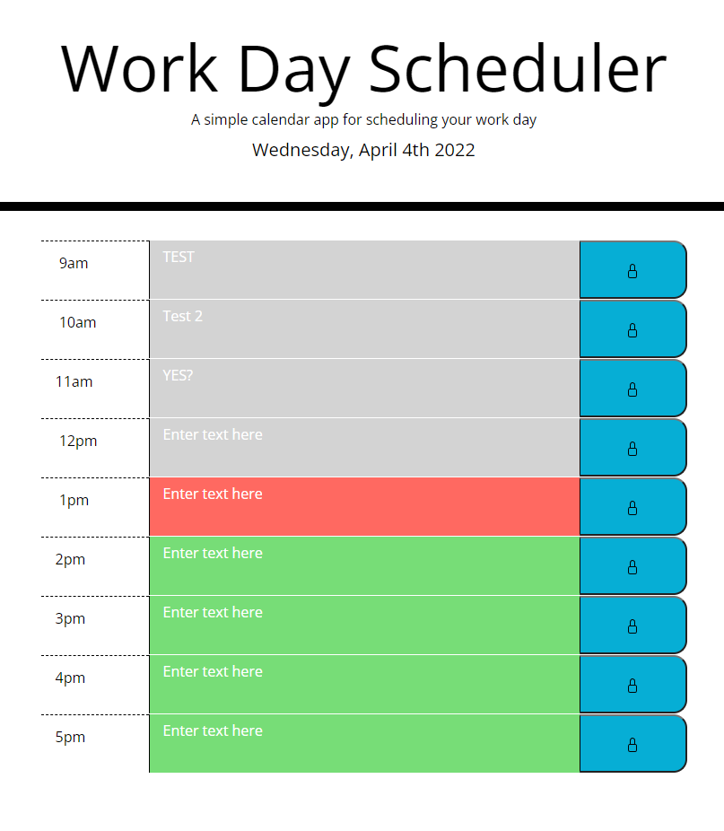

# Work Day Scheduler

## This application schedules the work day hour by hour.

link: https://caleeeb.github.io/work-day-scheduler/

## What to expect:

1. Can edit text for each hour.
2. Edited text is saved in local storage and will exist apon page reload. 
3. Each hour will have different colors depending on the time of day: 
*past hours: grey
*current hour: red
*future hour: green

## Enojoy!